# Aentic Exam Framework - System Architecture Diagrams

## Table of Contents
1. [High-Level System Architecture](#high-level-system-architecture)
2. [Component Architecture](#component-architecture)
3. [Data Flow Diagrams](#data-flow-diagrams)
4. [Database Schema](#database-schema)
5. [Security Architecture](#security-architecture)
6. [Deployment Architecture](#deployment-architecture)
7. [Scalability Architecture](#scalability-architecture)

## High-Level System Architecture

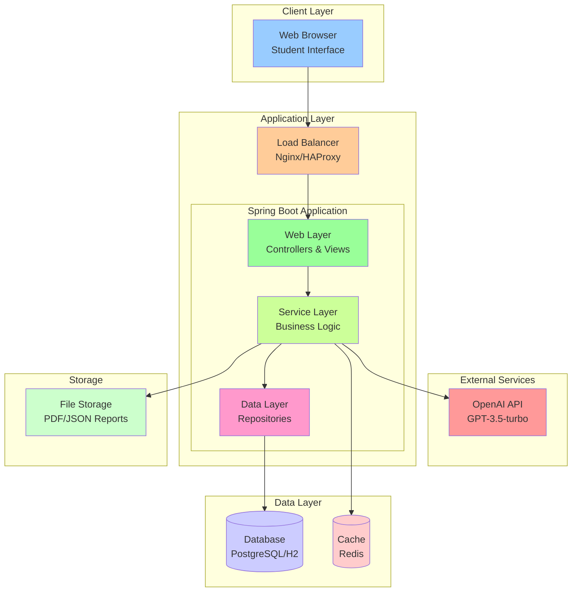

## Component Architecture

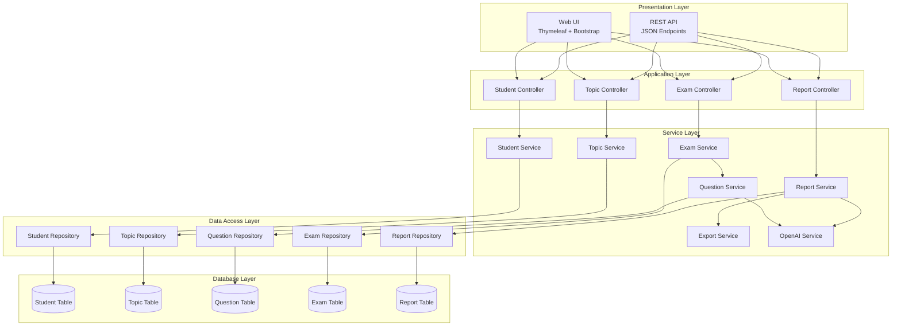

## Data Flow Diagrams

### Student Registration Flow

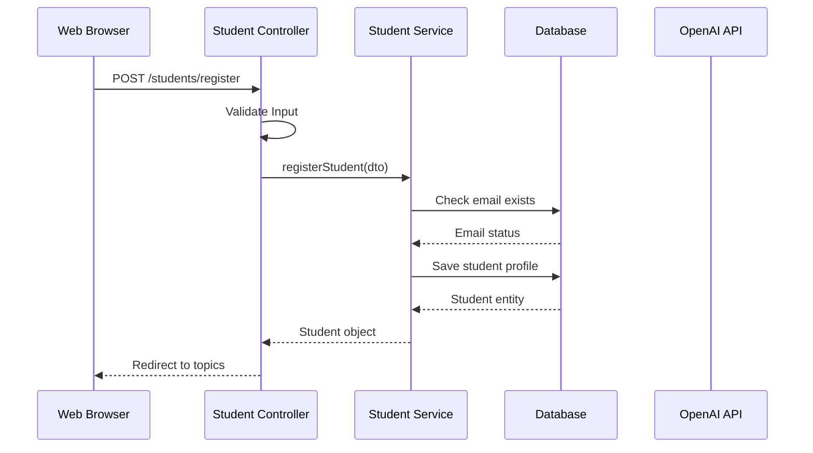

### AI Question Generation Flow

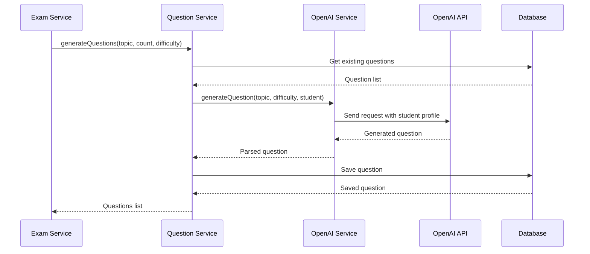

### Report Generation Flow

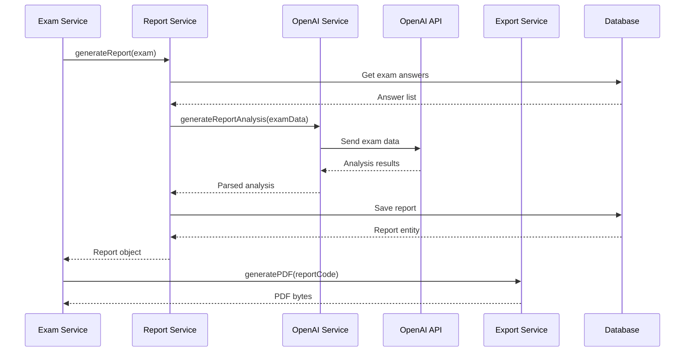

## Database Schema

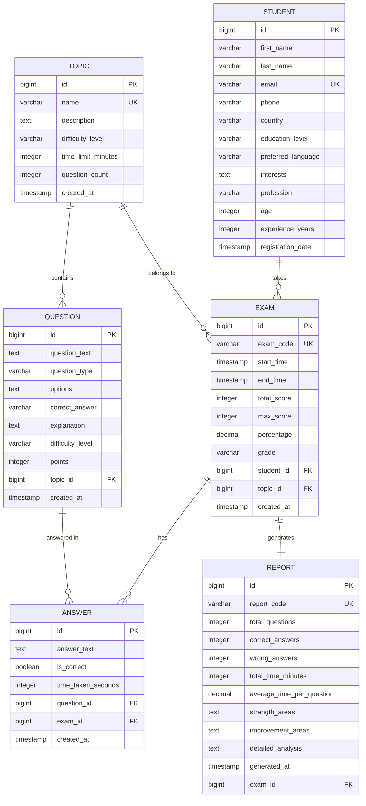

## Security Architecture

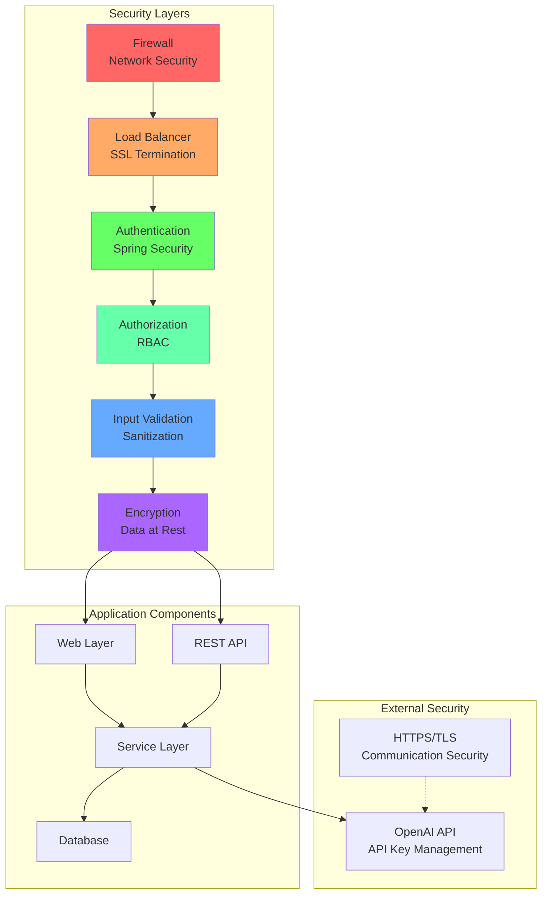

## Deployment Architecture

### Development Environment

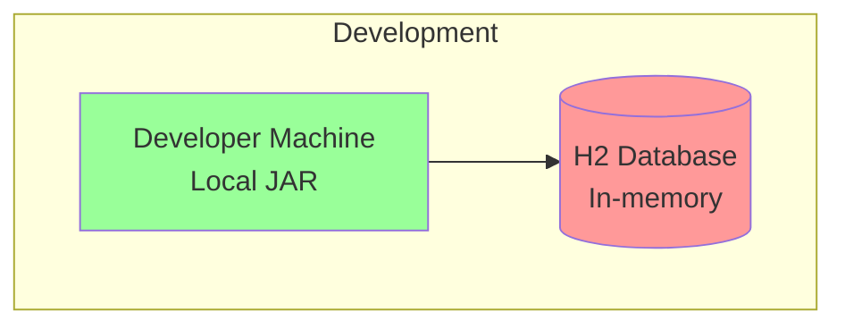

### Production Environment

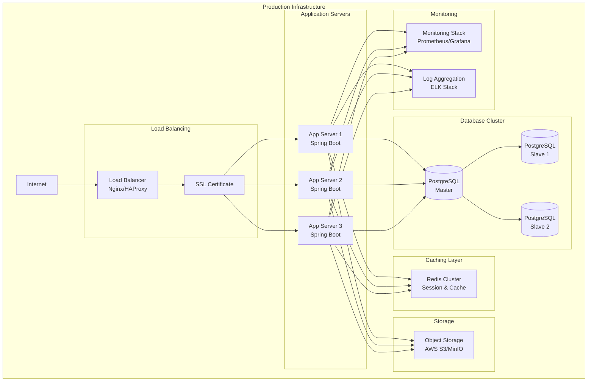

### Container-Based Deployment

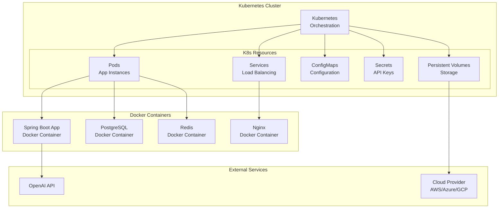

## Scalability Architecture

### Horizontal Scaling

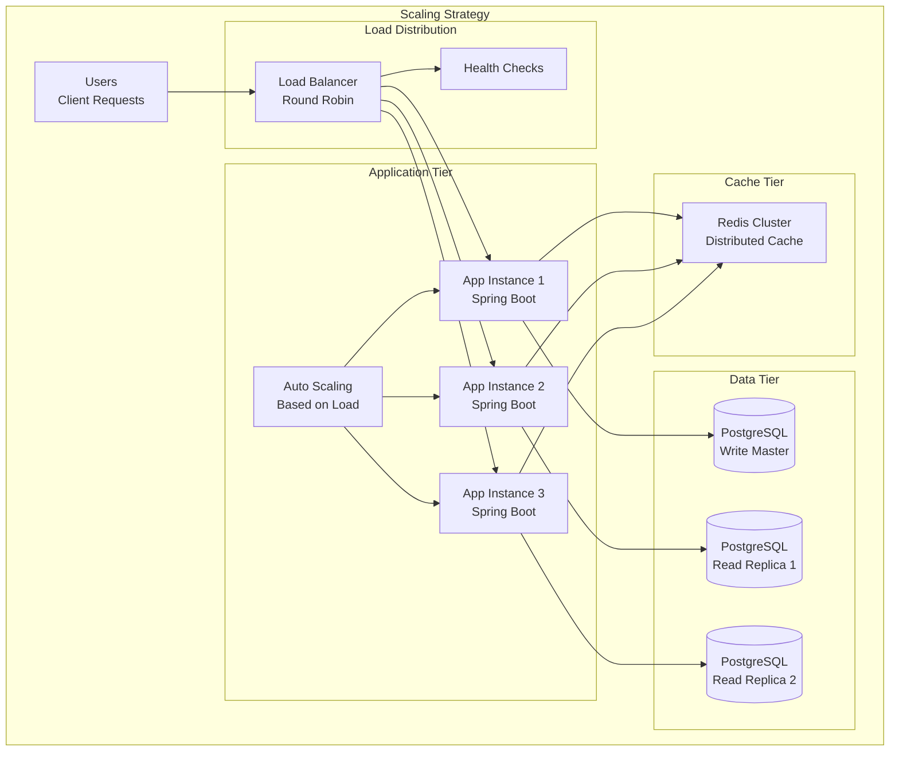

### Caching Strategy

```mermaid
graph TB
    subgraph "Multi-Level Caching"
        Browser[Browser Cache<br/>Static Assets]
        
        subgraph "Application Cache"
            L1[L1 Cache<br/>Application Memory]
            L2[L2 Cache<br/>Redis Cluster]
        end
        
        subgraph "Database Cache"
            Query[Query Cache<br/>PostgreSQL]
            Buffer[Buffer Pool<br/>Database Memory]
        end
        
        subgraph "CDN"
            CDN[Content Delivery Network<br/>Static Files]
        end
    end
    
    Browser --> CDN
    Browser --> L1
    L1 --> L2
    L2 --> Query
    Query --> Buffer
```

## Performance Monitoring

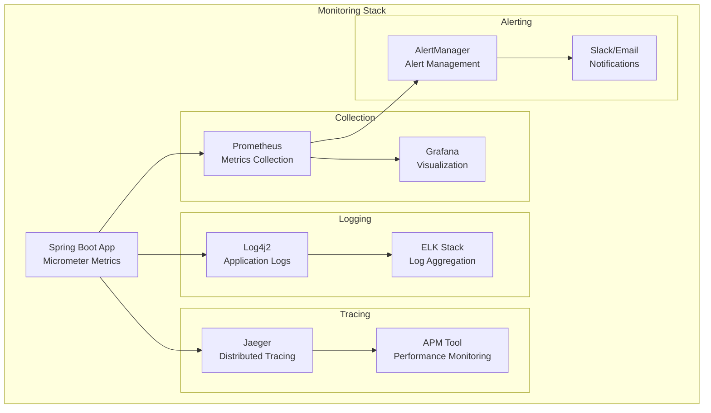

These diagrams provide a comprehensive visual representation of the Aentic Exam Framework's architecture, covering all major components, data flows, and deployment scenarios. Each diagram is designed to help understand different aspects of the system at various levels of detail.
